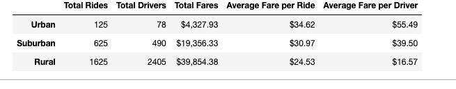
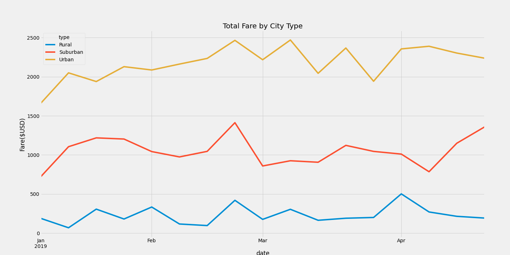

# PyBer_Analysis

## Overview of the Analysis:
  They want us to look at the the data for a ride share company in three areas. The areas were urban, suburban and rural. The first one they want use to do was to see how the compared to each other. They wanted us to do that by rides, fare and drivers. Now that we got that data for them they want ust to go more in deep with our analysis. They want use to use a multiple-line graph that shows the total weekly fares for each city type.
## Results

  Like you would think when you think of drivers for the ride shares are alot busier in the ubarn areas. It is almost 6x as busy as rural and 2.5x as suburban. at the same time you have the the rural drivers making more per fare than the other area. We can assume that is do to the distants that the driver has to drive per fare. Now when we make a chart of the total fare by city we see that it supports the observations that we made above. The one thing that you can see here that you can not tell by the numbers is how much urban fares go up and down depending on week. At the same time you can see that there are times when all three lins will go up or down. 

## Summary
  When you take in all the infomation i would like to look in to way there is som much movement in the fares. I would want to see if there are thing going on like sports, or events that are driving the line to go up. If we can see something like that going on i would tell that that they should run promo and other deals to get the rider ship up on slow weeks. The other thing i would suggest is that i would add a four column to see how many rides are going between mutltiple types to see if there is a need to hire more drivers in the slower cities that are willing to drive more and work in multiple areas.

